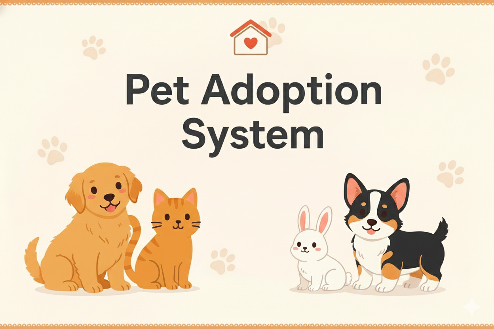
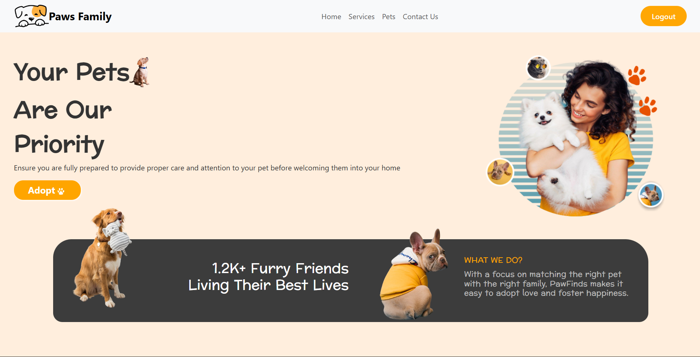
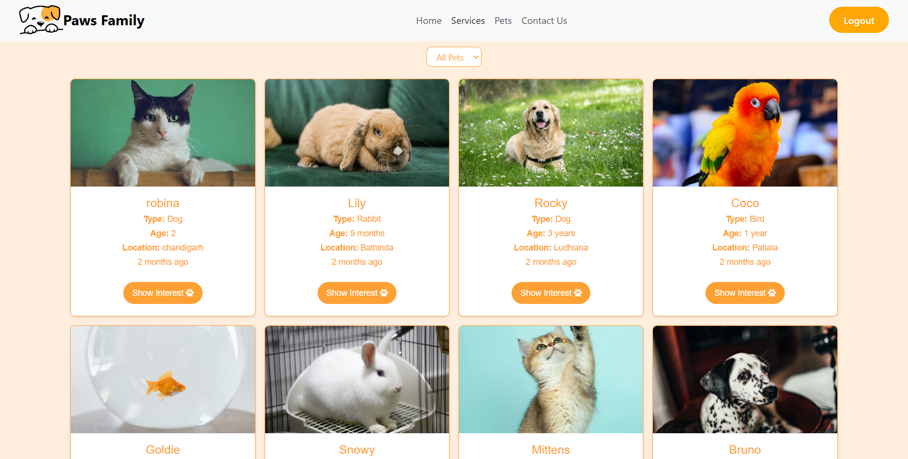
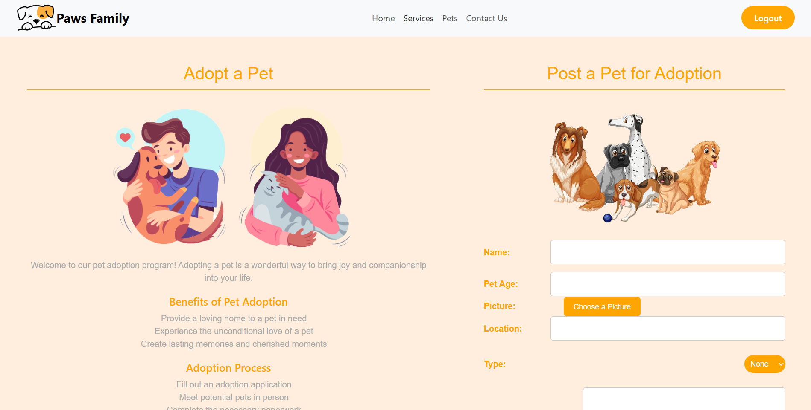

<h1 align="center">🐾 Pet Adoption System</h1>
<p align="center">
  
</p>
<p align="center">
  A clean and responsive <b>Frontend Pet Adoption System</b> built using HTML, CSS, and JavaScript.
  <br>
  Helping users explore pets, view details, and request adoption with a smooth UI experience.
</p>


---

## 📸 Screenshots

| Home Page | Pet Listing | Pet Form |
|-----------|-------------|-------------|
|  |  |  |


---

## 🧩 Features

- 🌟 Clean and modern adoption-themed UI  
- 📱 Fully responsive (Mobile + Tablet + Desktop)  
- 🐶 Dynamic pet cards with images  
- 🔍 Search & filter pets  
- 📄 Dedicated pet info   
- ❤️ Adoption request modal / form  
- 🎨 Smooth UI/UX with structured layout  

---

## 🛠️ Tech Stack (Frontend)

<p>
  
  
  
  
  
  
  
  
</p>

---

## 📂 Folder Structure
```text
PET-ADOPTION-SYSTEM/
├── backend/
│   ├── Controllers/
│   ├── Middleware/
│   ├── Model/
│   ├── Routes/
│   ├── uploads/
│   ├── server.js
│   └── package.json
│
├── frontend/
│   ├── public/
│   ├── src/
│   │   ├── assets/
│   │   ├── Components/
│   │   │   ├── AdminPanel/
│   │   │   ├── AdoptForm/
│   │   │   ├── Auth/
│   │   │   ├── Contact/
│   │   │   ├── Footer/
│   │   │   ├── Home/
│   │   │   ├── Navbar/
│   │   │   ├── Pets/
│   │   │   └── Services/
│   │   ├── App.jsx
│   │   ├── App.css
│   │   └── main.jsx
│   ├── vite.config.js
│   └── package.json
│
├── Runcommand
└── README.md
```


